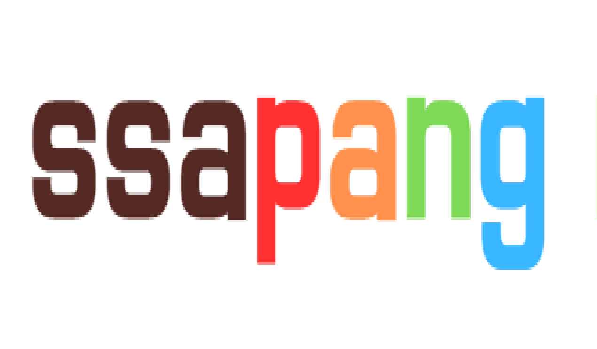
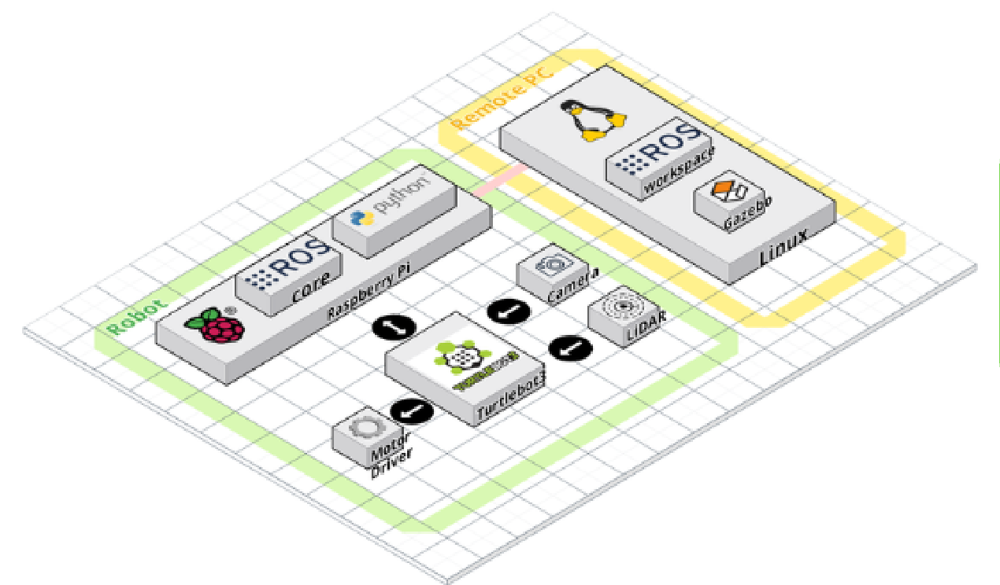

# SSAPANG
> 인력부족과 인건비 상승으로 어려움을 겪는   
> 물류산업을 혁신하는 물류 자동화 솔루션

## 주요기능

- TURTLE BOT과 커스텀 매니퓰레이터을 활용한 다양한 임무 수행
- ROS통신을 이용한 로봇 군집제어
- 무인자동화된 물류 시스템을 확인할 수 있는 시뮬레이션

## 세부기능
|구분|기능|설명|비고|
|:---|:---|:---|:---|
|1|물품 적재|TURTLE BOT Waffle을 통한 물품 적제||
|2|물품 운반|커스텀 매니퓰레이터와 TURTLE BOT Burger를 통한 물품 운반||
|3|경로 생성|Dijkstra알고리즘을 활용한 최적의 이동경로 생성||
|4|군집제어|ROS통신을 이용한 로봇 군집제어||

## 아키텍처

## 설치

_설치는 다음을 참조하십시오. [포팅메뉴얼](exec/포팅매뉴얼_StarryNight.pdf)_ 

## 사용 예시

_자세한 예와 용도는 다음을 참조하십시오. [Wiki][wiki]._

## 프로젝트 구성원

- 8기 곽준영
- 8기 김동현
- 8기 신승호
- 8기 유현준
- 8기 이학준
- 8기 박찬호

